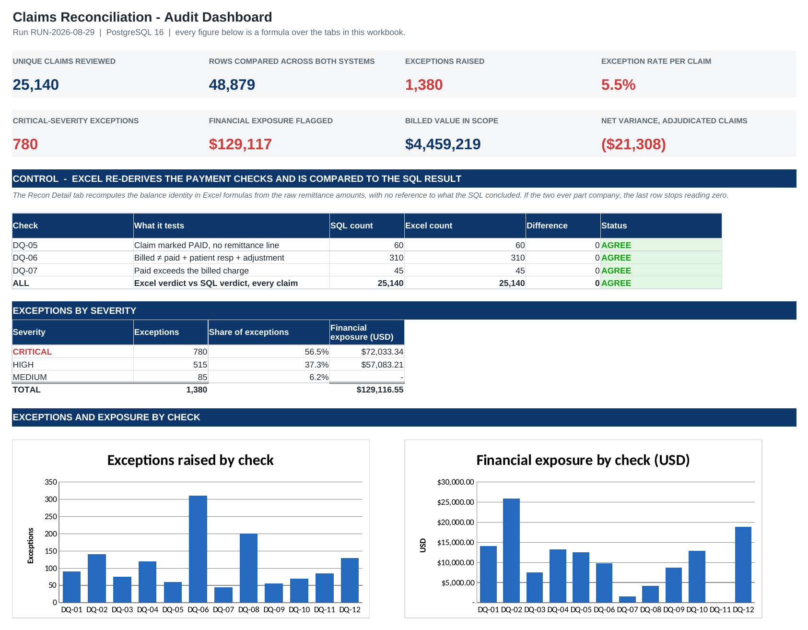

# Healthcare Claims Reconciliation & Data Quality Audit

Reconciles a claims billing extract against payer remittance data, finds where the two
disagree, and documents the checks well enough that someone else could run them next month.

**Stack:** PostgreSQL 16 · Excel · Python 3 (data generation only)

---

## What this is

A revenue cycle operations team receives two feeds every day: claims submitted by the billing
system, and payments posted from payer remittance advice. The two are supposed to foot to each
other. In practice they do not, and the job is to find out where, how much it is worth, and who
has to fix it.

This project builds that process end to end on a synthetic dataset of **25,230 claim rows and
23,649 remittance rows — 48,879 rows compared across two systems**.

It contains:

- a **12-check data quality suite** in PostgreSQL, one file per check, each with an explicit
  failure condition
- an **exception register** — every finding as a worked row, routed to an owning queue
- an **Excel audit workbook** that re-derives the payment checks in native formulas and
  cross-foots its own answers against the SQL
- a **test plan**, a **defect log**, and a **one-page SOP**
- a **validation harness** that scores the suite against a ledger of known defects, plus a
  negative control that proves the checks stay silent on clean data

---

## Results of the 2026-08-29 run




| | |
|---|---|
| Claim rows received | 25,230 |
| Unique claims after de-duplication | 25,140 |
| Remittance rows received | 23,649 |
| **Total rows compared** | **48,879** |
| Billed value in scope | $4,459,219.00 |
| Exceptions raised | 1,380 (5.49% of claims) |
| Financial exposure flagged | $129,116.55 |
| Net variance on adjudicated claims | −$21,307.73 |

### Headline findings

| Finding | Volume | Exposure |
|---|---|---|
| Duplicate claims (90 exact claim-id resends + 140 duplicate billing fingerprints) | **230** | $39,966.00 |
| Claim-to-payment amount mismatches — billed does not equal paid + patient responsibility + adjustment | **310** | $9,765.55 |
| Overpayments — paid above the billed charge | 45 | $1,495.36 |
| Orphaned remittance records — payment posted against a claim that does not exist | **120** | $13,269.45 |
| Duplicate remittance postings — the same claim paid twice on one check | 75 | $7,536.98 |
| Underpayments below the contracted rate | 200 | $4,140.21 |
| Missing remittance on claims marked PAID | 60 | $12,524.00 |
| Field, payer, NPI and date integrity defects | 340 | $40,419.00 |

Full breakdown: [`docs/FINDINGS.md`](docs/FINDINGS.md) ·
Exception files: [`output/exceptions/`](output/exceptions)

---

## The 12 checks

| ID | Check | Dimension | Severity | Found |
|---|---|---|---|---|
| DQ-01 | Duplicate claim identifiers | Uniqueness | CRITICAL | 90 |
| DQ-02 | Duplicate billing fingerprint | Uniqueness | CRITICAL | 140 |
| DQ-03 | Duplicate remittance posting | Uniqueness | CRITICAL | 75 |
| DQ-04 | Orphaned remittance record | Integrity | CRITICAL | 120 |
| DQ-05 | Missing remittance for a paid claim | Completeness | HIGH | 60 |
| DQ-06 | Claim-to-payment amount mismatch | Consistency | CRITICAL | 310 |
| DQ-07 | Overpayment | Consistency | CRITICAL | 45 |
| DQ-08 | Allowed amount below contract | Consistency | HIGH | 200 |
| DQ-09 | Unmapped payer identifier | Integrity | HIGH | 55 |
| DQ-10 | Invalid provider NPI | Validity | HIGH | 70 |
| DQ-11 | Temporal integrity break | Timeliness | MEDIUM | 85 |
| DQ-12 | Missing or malformed mandatory field | Completeness | HIGH | 130 |

Each check is one file in [`sql/checks/`](sql/checks) with its failure condition stated in the
header. The full definitions, tolerances and escalation paths are in
[`docs/TEST_PLAN.md`](docs/TEST_PLAN.md).

### The reconciliation rule

Everything on the money side hangs off one identity:

```
billed_amount = paid_amount + patient_responsibility + contractual_adjustment
```

A claim that fails it by more than one cent has not been reconciled, and the variance is the
amount nobody has accounted for. DQ-06 tests it directly; DQ-07 and DQ-08 test the two ways it
fails that need a different queue and a different clock.

---

## How the checks were proved

A query that returns rows proves nothing on its own — a wrong query returns rows too. Two
controls establish that these checks work.

**1. Scored against known defects.** The data generator writes a ledger of every defect it
plants ([`data/raw/_injected_defect_ledger.csv`](data/raw)). The suite is scored against that
ledger, per check:

```
 check_id | seeded | detected | true positives | false neg | false pos | recall | precision
----------+--------+----------+----------------+-----------+-----------+--------+----------
 DQ-01    |     90 |       90 |             90 |         0 |         0 | 100.0% |    100.0%
 ...        all twelve checks: 1,380 seeded, 1,380 detected, 0 missed, 0 spurious
```

**2. Negative control.** The same 25,000 claims are regenerated with nothing wrong with them,
and all twelve checks must return zero rows:

```
$ ./tests/negative_control.sh
NEGATIVE CONTROL PASSED - 0 exceptions raised against a clean dataset.
```

Getting the suite to that point took three iterations. The first run had DQ-06 missing 74
mismatches and DQ-07 reporting 124 exceptions that were really duplicate postings — the defect
classes overlapped, so every count was contaminated. The fix was to make the classification
mutually exclusive and write the exclusions into the check headers, where the next analyst can
see them. All three iterations are recorded in [`docs/TEST_PLAN.md`](docs/TEST_PLAN.md) §7.1 —
a check suite that was never wrong was never tested.

---

## The Excel workbook

[`output/Claims_Reconciliation_Audit.xlsx`](output/Claims_Reconciliation_Audit.xlsx) — 8 tabs,
127,332 live formulas, no hardcoded results. GitHub cannot preview `.xlsx`, so use the
**Download raw file** button; the screenshot above is the Dashboard tab.

The workbook is not a screenshot of the SQL output. It reloads the reconciliation grain and
**re-derives DQ-05, DQ-06 and DQ-07 in native Excel formulas** from the raw remittance amounts,
with no reference to what the SQL concluded. The Dashboard then cross-foots the two:

| Check | SQL count | Excel count | Difference | Status |
|---|---|---|---|---|
| DQ-05 | 60 | 60 | 0 | AGREE |
| DQ-06 | 310 | 310 | 0 | AGREE |
| DQ-07 | 45 | 45 | 0 | AGREE |
| All claims | 25,140 | 25,140 | **0** | AGREE |

If either side is wrong about a single claim out of 25,140, that last row stops reading zero.

| Tab | Contents |
|---|---|
| Dashboard | Control totals, the SQL/Excel cross-foot, severity mix, two charts |
| Read Me | Run parameters, tolerances, conventions, tab guide |
| Check Summary | The 12 checks with counts and exposure computed by `COUNTIF`/`SUMIF` |
| Defect Log | One entry per defect class: root cause, owner, exposure, SLA, status |
| Exception Register | All 1,380 exceptions with evidence and routing |
| Recon Detail | 25,140 claims with the Excel-side checks recomputed live |
| Payer Scorecard | Exceptions per 1,000 claims by payer |
| Suite Validation | Recall and precision per check |

Formulas use `INDEX`/`MATCH`, `SUMIF`, `COUNTIF` and `SUMPRODUCT` rather than `XLOOKUP` or
`FILTER`, so the file behaves the same in Excel 2016, Microsoft 365, LibreOffice and Google
Sheets.

---

## Running it

Requires PostgreSQL 13+ and Python 3.9+. No Python packages are needed to run the audit —
only to rebuild the workbook.

```bash
# 1. connection details (any Postgres will do)
export PGHOST=localhost PGPORT=5432 PGUSER=postgres PGDATABASE=rcm_audit
createdb rcm_audit

# 2. regenerate the dataset (optional - the CSVs are committed)
python3 scripts/generate_data.py --claims 25000 --seed 20260829 --defects on

# 3. run the audit: schema, load, checks, reporting, exports
./scripts/run_audit.sh

# 4. prove the suite does not fire on clean data
./tests/negative_control.sh

# 5. rebuild the Excel workbook from the audit outputs
pip install -r requirements.txt
python3 scripts/build_workbook.py
```

The dataset is generated from a fixed seed, so step 2 reproduces the committed CSVs
byte for byte and every number in this README stays reproducible.

---

## Repository layout

```
sql/
  00_schema.sql        landing tables (all TEXT), reference data, check catalogue, helper functions
  01_load.sql          \copy the extracts in
  02_typed_views.sql   safe casts, de-duplication, the reconciliation grain
  03_checks.sql        loads the twelve check files
  04_reporting.sql     exception register, run summary, control totals, payer scorecard, validation
  05_run_audit.sql     execute the audit and print the summary
  06_export.sql        write the exception files and workbook inputs
  checks/              DQ-01 ... DQ-12, one file per check

scripts/
  generate_data.py     seeded synthetic RCM data generator with a defect ledger
  run_audit.sh         end-to-end run
  build_workbook.py    builds the Excel audit workbook from the audit outputs

tests/
  negative_control.sh  asserts zero exceptions against a clean dataset

docs/
  TEST_PLAN.md         the twelve checks: scope, method, tolerances, severity, pass criteria
  DEFECT_LOG.md        defects raised by the run, with root cause and disposition
  SOP_claims_reconciliation.md   one-page operating procedure and escalation matrix
  DATA_DICTIONARY.md   every field in both feeds and the reconciliation grain
  FINDINGS.md          the audit report for the 2026-08-29 run

data/
  raw/                 the two source extracts, plus the seeded defect ledger
  reference/           payer master and CPT reference

output/                exception files, control totals and the Excel workbook
```

---

## Design decisions worth explaining

**Landing tables are all `TEXT`.** If the loader casts on the way in, rows with a blank date or
a malformed code fail the load and the defects you were hired to find never reach the database.
Types are applied one layer up, where a failed cast becomes a finding instead of a load error.

**Duplicate keys are removed before reconciling, not after.** A duplicated `claim_id` fans out
the join to remittance and inflates every dollar total. The reconciliation runs on a
de-duplicated grain; the duplicates are not discarded, they are reported by DQ-01.

**Exception classes are mutually exclusive.** A payment above the charge appears once, under
DQ-07 — not also under DQ-06. A claim with a zero charge is a DQ-12 defect and is excluded from
reconciliation entirely, because there is nothing to reconcile it to. Each exclusion is stated
in the check header, so the counts add up and the same claim never lands in two queues.

**The typed layer is materialised.** As plain views, the per-row safe-cast functions were
re-evaluated by all twelve checks on every run, which took an audit run from seconds to
minutes. Materialising once cut it to about two seconds.

**Every exception carries an owner.** A finding with no queue attached is a report, not
operations work. The register stamps the owning queue on every row, and the SOP defines the
escalation step and the clock.

---

## A note on the data

All claims, patients, providers, encounters and NPIs are synthetic and generated from a fixed
seed. No real patient or payer data was used, and none of this is PHI. Payer names are real
organisations, used only to make the payer mix look like a plausible book of business — no real
contract terms, fee schedules or rates are represented. Generated NPIs are format-valid (they
satisfy the CMS Luhn check) but are not registered numbers.

## Licence

MIT — see [LICENSE](LICENSE).
